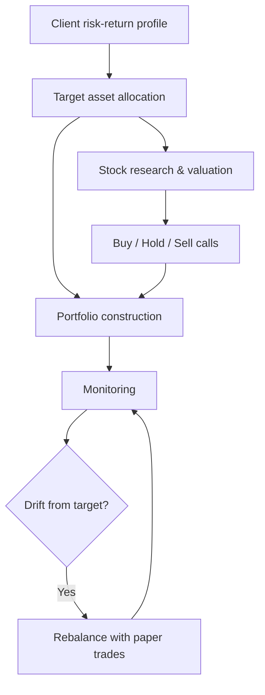

# Portfolio Manager

A portfolio management platform for managing multiple client portfolios. It combines client risk profiling, fundamental stock research, rebalancing and paper trading, and runs locally on live market data.

Built by **Don Benni**, MBA Finance (Golden Gate University), CFA Level I Candidate.

---

## What it does

| Area | Capability |
|---|---|
| **Client portfolios** | Builds and monitors a separate portfolio for each client, based on that client's risk-return profile |
| **Stock research** | Researches stocks with financial modeling and produces **Buy / Hold / Sell** calls |
| **Rebalancing** | Flags portfolios that drift from their target allocation and executes the rebalancing trades |
| **Paper trading** | Works as a paper-trading account, so strategies can be tested without real capital |
| **Markets overview** | The home page shows world indices, commodities and a personal watchlist |

## Why I built it

I wanted to work through the full portfolio management process in one tool: understanding the client, researching securities, constructing and monitoring portfolios, and keeping them on target. That's the work done in portfolio management and equity research roles. The project applies what I've learned in my MBA and the CFA curriculum (asset allocation, valuation and portfolio construction) to a working system.

## Investment process

## Disclaimer

This project is for education and research only. It uses paper trading and is not investment advice.

## Contact

Don Benni · [GitHub](https://github.com/donbenni122000-creator)
